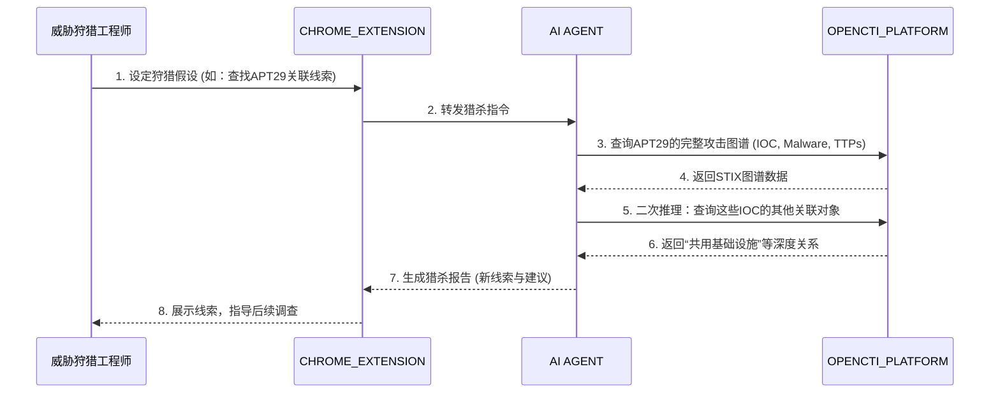

**核心价值**：变“被动告警”为“主动狩猎”，利用 OpenCTI 的关系图谱发现已入侵但未被告警的线索。

1. **触发**：威胁狩猎工程师（`{08F57293-EA91-46d1-BD83-87C1875C05A5}`）在 `CHROME_EXTENSION` 中设定一个狩猎假设，例如：“查找环境中是否存在与 APT29 组织相关的任何未处置的蛛丝马迹”。
    
2. **查询与关联**：
    
    - 工程师通过插件，调用后端的 `AI AGENT` 或直接向 `ai4x_platform` 发起查询。
        
    - 查询请求被路由到 `OPENCTI_PLATFORM`：`MATCH (n:Indicator)-[r:indicates]->(m:Malware)-[s:attributed-to]->(o:IntrusionSet {name: 'APT29'}) RETURN n, m, o`。
        
    - OpenCTI 返回一个情报子图：包含 APT29 组织、其使用的多个恶意软件家族（如 WellMess），以及这些恶意软件对应的所有 IOC（IP、域名、HASH）。
        
3. **交叉比对**：
    
    - `AI AGENT` 获取到这批 IOC 列表后，不会直接去扫描全量日志（仅依赖 OpenCTI 数据），而是**利用 OpenCTI 自身的关系进行二次推理**。
        
    - Agent 查询：`这些 IOC 还关联到了哪些其他尚未被我们注意到的Intermediate Objects？` 例如，某个 C2 域名同时被 `Indicators` 指向了 `APT29` 和另一个名为 `DarkHotel` 的组织。
        
4. **发现新线索**：这个“共用的C2域名”成为了一个高价值线索。它可能意味着：
    
    - APT29 和 DarkHotel 使用了同一套基础设施。
        
    - 或者我们的环境可能同时受到两个组织的威胁。
        
5. **生成猎杀报告**：`AI AGENT` 生成一份报告，指出：“基于 OpenCTI 图谱分析，检测到与 APT29 相关的 IP `185.130.5.253` 同时被标记为与 `DarkHotel` 相关。虽无直接告警，但建议对该 IP 的通信进行深入包分析。” 工程师据此调整日志搜索或网络抓包策略。

**端到端业务过程（角色与系统交互）**：

## 该场景依赖的数据（基于当前对外 SCHEMA）

### 1. 数据源依赖

该场景当前**核心依赖且已对外暴露**的数据源是：

| source_id | 类型 | 用途 |
| --- | --- | --- |
| `opencti` | `opencti` | 提供基于 STIX 2.1 的威胁情报对象、关系和可观测数据，用于完成“组织 - 恶意软件 - IOC - 基础设施”关联图谱猎杀。 |

调用侧应先通过以下接口发现并拉取 Schema：

1. `GET /api/v1/api-center/schema/catalog`
2. `GET /api/v1/api-center/schema/opencti`

当前 `opencti` 数据源并不是单一业务对象，而是聚合了 `schema/STIX_schema` 目录下的 STIX 2.1 Schema，包含 `common`、`observables`、`sdos`、`sros` 四类，共 57 个 Schema 文件。

### 2. 场景必需的对象类型

为支撑“从 APT29 出发，沿图谱扩展到恶意软件、IOC、共用基础设施，再发现新的关联组织或新线索”这一流程，至少需要以下对象类型。

| STIX 对象 | 关键字段 | 在本场景中的作用 |
| --- | --- | --- |
| `intrusion-set` | `id`、`name`、`aliases`、`description`、`first_seen`、`last_seen` | 表示攻击组织/团伙，如 `APT29`、`DarkHotel`，是猎杀假设的起点对象。 |
| `malware` | `id`、`name`、`is_family`、`aliases`、`malware_types`、`capabilities`、`first_seen`、`last_seen` | 表示与组织关联的恶意软件家族，如 `WellMess`，用于向下游 IOC 和基础设施扩展。 |
| `indicator` | `id`、`name`、`indicator_types`、`pattern`、`pattern_type`、`valid_from` | 承载 IOC 检测规则，是从威胁团伙或恶意软件向 IP、域名、HASH 等线索收敛的关键对象。 |
| `infrastructure` | `id`、`name`、`infrastructure_types`、`aliases`、`first_seen`、`last_seen` | 表示 C2、投递、钓鱼、匿名化等基础设施，可用于识别“共用 C2 域名/地址”等高价值线索。 |
| `relationship` | `id`、`relationship_type`、`source_ref`、`target_ref`、`start_time`、`stop_time` | 串联组织、恶意软件、IOC、基础设施，是“关联图谱”可推理的核心边数据。 |

### 3. 场景必需的可观测数据类型

该场景最后落地到“可执行排查的 IOC”，因此还需要以下可观测对象：

| Observable 对象 | 关键字段 | 在本场景中的作用 |
| --- | --- | --- |
| `domain-name` | `id`、`value`、`resolves_to_refs` | 表示恶意域名或 C2 域名，可继续解析到 IP 并发现是否被多个团伙或恶意软件复用。 |
| `ipv4-addr` | `id`、`value`、`resolves_to_refs`、`belongs_to_refs` | 表示外联 IP、C2 IP 或投递节点，是报告里最直接可用于排查的网络线索。 |
| `file` | `id`、`hashes`、`name`、`size`、`mime_type` | 表示样本文件或 HASH，用于把 IOC 从网络侧扩展到样本侧。 |

### 4. 为了让“未知威胁猎杀”成立，还需要的观测与命中数据

如果希望不仅看到“情报上的关联”，还要支持“该线索是否在我方环境出现过”的进一步判断，则应补齐以下对象：

| STIX 对象 | 关键字段 | 在本场景中的作用 |
| --- | --- | --- |
| `observed-data` | `id`、`first_observed`、`last_observed`、`number_observed`、`objects` 或 `object_refs` | 表示被实际观测到的网络或主机事实，可承接域名、IP、文件等原始观测。 |
| `sighting` | `id`、`sighting_of_ref`、`observed_data_refs`、`where_sighted_refs`、`first_seen`、`last_seen`、`count` | 表示某个 IOC/恶意软件/工具被看见过，是把“图谱关联”升级为“环境命中”的关键证据。 |

### 5. 本场景最小数据闭环

按当前对外 Schema，这个场景至少应具备如下数据链路：

1. `intrusion-set(APT29)` 作为起点。
2. 通过 `relationship` 关联到 `malware` 和/或 `infrastructure`。
3. 再通过 `relationship` 关联到 `indicator`。
4. `indicator` 的 `pattern` 中可落到 `domain-name`、`ipv4-addr`、`file.hashes` 等 observable。
5. 同一个 `domain-name` 或 `ipv4-addr` 若又通过其他 `relationship` 指向第二个 `intrusion-set`，即可构成“共用基础设施”或“潜在未知关联”的猎杀线索。
6. 若同时存在 `sighting` 和 `observed-data`，则该线索可进一步升级为“在我方环境中出现过的高优先级调查对象”。

### 6. 与当前场景描述的对应关系

当前文档中提到的“APT29 -> WellMess -> IOC -> 共用 C2 域名 -> DarkHotel”路径，映射到对外 Schema 后，可抽象为：

1. `intrusion-set`：APT29、DarkHotel。
2. `malware`：WellMess。
3. `indicator`：指向 IP、域名、HASH 的检测规则。
4. `domain-name` / `ipv4-addr` / `file`：可落地执行排查的 IOC 实体。
5. `infrastructure`：对 C2、匿名化、投递等基础设施进行归一化表达。
6. `relationship`：承担 `uses`、`indicates`、`related-to` 等图谱边。
7. `observed-data` + `sighting`：在需要从“情报关联”走向“环境验证”时提供事实支撑。

### 7. 当前不构成本场景核心依赖的数据源

按 AI4X-Platform 当前公开的 Schema，`tara`、`ses`、`vehicle_iobe`、`vehicle_func`、`ecu_func`、`func_design_spec`、`cve2oss` 并不是该场景的必需前置数据。它们可用于后续把威胁情报线索映射到车辆资产、功能、ECU、设计规格或漏洞处置流程，但不构成“基于关联图谱的未知威胁猎杀”这一场景成立的最小输入。