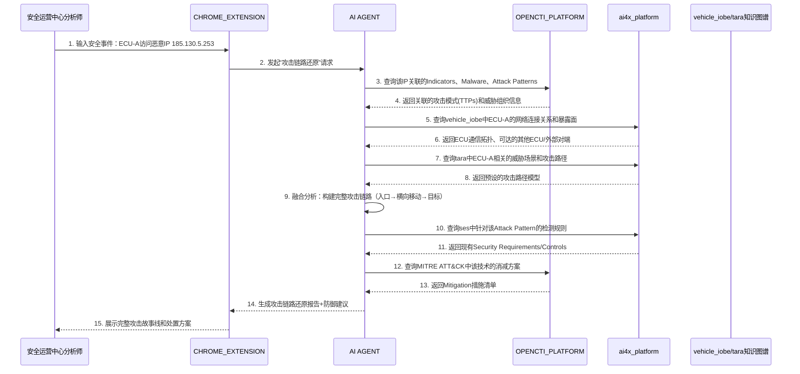

### 核心价值

将单点安全告警（如某ECU访问恶意IP）自动扩展为完整的攻击链路，映射到MITRE ATT&CK杀伤链阶段，并基于攻击模式从知识库中检索现有的检测规则（Indicator）和消减方案（Mitigation），为安全响应人员提供“从事件到防御”的完整决策支持。

---

### 端到端业务过程


### 场景详细流程

#### 步骤 1：触发与输入

**触发角色**：安全运营中心分析师（`{B3FBCCA5-C8B9-49ad-9283-BDF2A5C2AD86}`）

**输入内容**：一个安全事件告警，例如：

> “T-Box ECU (ID: ECU-TBOX-001) 在 2026-04-27 08:32:15 发起了对恶意 IP 185.130.5.253 的 DNS 请求，域名为 [evil.c2.com](https://evil.c2.com/)。”

分析师在 `CHROME_EXTENSION` 中选中该事件，右键选择“还原完整攻击链路”。

#### 步骤 2：IP/域名威胁情报查询

`AI AGENT` 向 `OPENCTI_PLATFORM` 发起查询：
```cypher
MATCH (i:Indicator)-[:indicates]->(m:Malware)-[:attributed-to]->(o:IntrusionSet)
WHERE i.pattern CONTAINS "185.130.5.253" OR i.pattern CONTAINS "evil.c2.com"
RETURN i, m, o
```

**返回示例**：

- Indicator：`C2通信检测 - domain:evil.c2.com`
    
- Malware：`SilverFox`（远控木马）
    
- IntrusionSet：`APT-C-23`（疑似中东背景）
    
- Attack Pattern：`T1071.001`（Application Layer Protocol: Web Protocols）
    

#### 步骤 3：受损资产上下文查询
`AI AGENT` 向 `ai4x_platform` 查询 `vehicle_iobe` 中 ECU-TBOX-001 的完整上下文：
```cypher
MATCH (e:x-vehicle-ecu {name: "ECU-TBOX-001"})
OPTIONAL MATCH (e)-[:exposes]->(s:x-exposure-surface)
OPTIONAL MATCH (e)-[:communicates_with]->(p:x-external-peer)
OPTIONAL MATCH (e)-[:transmitted_by]->(t:network-traffic)-[:connects_to]->(target)
RETURN e, s, p, t, target
```

**返回示例**：

- 暴露面：蜂窝网络（4G/5G）、Wi-Fi
    
- 通信对端：云端TSP平台、OTA服务器、手机App
    
- 可达的内部ECU：网关(GW)、信息娱乐系统(IVI)
    

#### 步骤 4：预设攻击路径匹配

`AI AGENT` 向 `tara` 查询涉及 ECU-TBOX-001 的预设攻击路径：
```cypher
MATCH (a:x-attack-path)-[:affects]->(c:x-vehicle-component {name: "ECU-TBOX-001"})
RETURN a
```

**返回示例**：

- 攻击路径1：外部蜂窝网络 → T-Box → CAN总线 → 制动ECU
    
- 攻击路径2：恶意App → 手机互联 → T-Box → IVI
    

#### 步骤 5：攻击链路融合构建

`AI AGENT` 将三类信息融合，构建完整攻击链路：

|杀伤链阶段|MITRE ATT&CK技术|当前事件证据|下一步风险|
|---|---|---|---|
|初始访问(TA0001)|T1566 - 钓鱼|待确认（可能通过恶意App）|-|
|执行(TA0002)|T1204 - 用户执行|待确认|-|
|持久化(TA0003)|T1542 - 预启动启动|待确认|-|
|防御规避(TA0005)|T1027 - 混淆文件|SilverFox使用加密通信|-|
|**命令与控制(TA0011)**|**T1071.001 - Web协议**|**✅ 已检测到[evil.c2.com](https://evil.c2.com/)**|已受控|
|横向移动(TA0008)|T1570 - 横向工具传输|威胁情报显示SilverFox支持横向移动|可能从T-Box移动到GW/IVI|
|影响(TA0040)|T1486 - 加密勒索|威胁情报显示该组织曾发起勒索|制动系统/行驶安全受影响|

#### 步骤 6：检测规则检索
`AI AGENT` 向 `ses`（网络安全需求库）查询针对该攻击模式的现有检测规则：
```cypher
MATCH (r:x-cybersecurity-requirement)
WHERE r.keywords CONTAINS "C2" OR r.keywords CONTAINS "T1071" OR r.keywords CONTAINS "通信检测"
RETURN r
```

**返回示例**：

- **Req-SIG-001**：异常外连域名检测 - 匹配已知恶意域名黑名单
    
- **Req-SIG-002**：Beacon通信模式检测 - 定期外发心跳包特征
    
- **Req-DNS-001**：DNS隧道检测 - 域名长度异常/熵值过高
    

同时 `AI AGENT` 可向 `OPENCTI` 查询该 Attack Pattern 对应的 Sigma 规则或 YARA 规则。

#### 步骤 7：消减方案检索

`AI AGENT` 向 `OPENCTI` 查询 MITRE ATT&CK 中 T1071.001 的消减方案：
```cypher
MATCH (ap:attack-pattern {external_id: "T1071.001"})-[:mitigated_by]->(m:course-of-action)
RETURN m
```

**返回示例**：

- **M1037**：网络流量过滤 - 在边界防火墙/网关限制出站流量到已知必要域名
    
- **M1031**：网络入侵防御 - 部署IPS检测C2通信模式
    
- **M1018**：用户账户控制 - 限制T-Box运行不必要的可执行文件
    

同时从 `ses` 中检索已定义的安全消减措施。

#### 步骤 8：生成综合报告

`AI AGENT` 输出结构化报告：
```json
{
  "event_summary": {
    "source_ecu": "ECU-TBOX-001",
    "malicious_ip": "185.130.5.253",
    "malicious_domain": "evil.c2.com",
    "detected_at": "2026-04-27T08:32:15Z"
  },
  "attack_chain": [
    {
      "phase": "Command & Control",
      "technique_id": "T1071.001",
      "technique_name": "Web Protocols",
      "evidence": "DNS请求命中威胁情报",
      "confidence": "高"
    },
    {
      "phase": "Lateral Movement",
      "technique_id": "T1570",
      "technique_name": "Lateral Tool Transfer",
      "evidence": "SilverFox历史行为",
      "confidence": "中",
      "potential_targets": ["Gateway", "IVI"]
    }
  ],
  "existing_detections": [
    {
      "name": "异常外连域名检测",
      "source": "ses",
      "status": "已部署",
      "effectiveness": "本次已触发"
    }
  ],
  "missing_detections": [
    {
      "name": "Beacon通信模式检测",
      "source": "ses",
      "recommendation": "建议增强部署"
    }
  ],
  "mitigations": [
    {
      "technique": "T1071.001",
      "mitigation_id": "M1037",
      "action": "限制T-Box出站流量目标域名白名单",
      "responsible": "IT安全经理",
      "urgency": "高",
      "estimated_effort": "2小时"
    },
    {
      "technique": "T1071.001",
      "mitigation_id": "M1031",
      "action": "在T-Box与云端之间部署IPS",
      "responsible": "安全架构师",
      "urgency": "中",
      "estimated_effort": "3天"
    }
  ],
  "recommended_immediate_actions": [
    "1. 隔离ECU-TBOX-001，阻断其出站流量",
    "2. 提取该ECU的DNS缓存和进程列表用于取证",
    "3. 检查网关ECU是否存在异常流量",
    "4. 将evil.c2.com加入全局黑名单"
  ]
}
```

## 该场景依赖的数据（基于当前对外 SCHEMA）

### 1. 数据源依赖

该场景当前的核心数据源依赖如下：

| source_id | 类型 | 用途 |
| --- | --- | --- |
| `opencti` | `opencti` | 提供 `indicator`、`attack-pattern`、`malware`、`intrusion-set`、`course-of-action`、`observed-data`、`relationship`、`sighting` 等 STIX 2.1 对象，用于从安全事件补齐威胁上下文、攻击技术和高层级消减措施。 |
| `vehicle_iobe` | `neo4j` | 提供 `x-vehicle-ecu`、`x-exposure-surface`、`x-external-peer`、`network-traffic`、`relationship`，用于恢复受影响 ECU 的暴露面、通信路径和可达范围。 |
| `tara` | `neo4j` | 提供 `x-threat-scenario`、`x-damage-scenario`、`x-attack-path`、`x-attack-feasibility` 等对象，用于把事件映射到已有威胁场景、损害场景和攻击路径描述。 |
| `ses` | `mongodb` | 提供 `x-cybersecurity-requirement` 对象，用于承接安全需求、控制要求和消减措施描述。 |

在需要把影响从 ECU 层进一步上卷到功能层时，还可选接入：

| source_id | 类型 | 用途 |
| --- | --- | --- |
| `ecu_func` | `neo4j` | 用于把受影响节点映射到 ECU 控制器与其功能集合。 |
| `vehicle_func` | `neo4j` | 用于把 ECU 影响进一步上卷到车辆功能域和产品能力层。 |

### 2. 场景必需的对象类型

按当前公开 Schema，要支撑“基于安全事件自动化还原攻击链路并生成防御方案”，至少需要以下对象：

| 对象类型 | 关键字段 | 在本场景中的作用 |
| --- | --- | --- |
| `observed-data` | `first_observed`、`last_observed`、`number_observed`、`objects` / `object_refs` | 承接安全事件中真实观测到的域名、IP、文件、网络连接等事实。 |
| `indicator` | `name`、`pattern`、`pattern_type`、`valid_from`、`valid_until` | 表达事件命中的 IOC 或后续可复用的检测指标。 |
| `attack-pattern` | `name`、`description`、`kill_chain_phases` | 表达与本事件相关的攻击技术和杀伤链阶段。 |
| `course-of-action` | `name`、`description` | 表达高层级的缓解、阻断或响应动作。 |
| `relationship` | `relationship_type`、`source_ref`、`target_ref`、`start_time`、`stop_time` | 串联 indicator、malware、intrusion-set、attack-pattern、course-of-action 等对象。 |
| `sighting` | `sighting_of_ref`、`observed_data_refs`、`first_seen`、`last_seen`、`count` | 把情报对象与真实事件观测绑定起来。 |
| `x-vehicle-ecu` | `name`、`x_ecu_type`、`x_software_version` | 定位被攻击或受影响的 ECU。 |
| `network-traffic` | `name`、`protocols`、`src_ref`、`dst_ref` | 表达车辆内外通信路径，用于推断横向可达关系。 |
| `x-attack-path` | `path`、`description`、`exposed_surface` | 表达 TARA 侧预定义或已建模的攻击路径描述。 |
| `x-cybersecurity-requirement` | `keywords/labels`、`cybersecurity_goal`、`cybersecurity_measure`、`text`、`x_domain_tag` | 表达内部安全要求或消减措施，不等同于厂商专有检测规则格式。 |

### 3. 当前 SCHEMA 下可稳定支撑的能力

依据当前对外 Schema，这个场景可以稳定支撑：

1. 基于 `opencti` 中的 `indicator`、`malware`、`intrusion-set`、`attack-pattern`、`relationship` 补齐 IP、域名、文件 HASH 对应的威胁上下文。
2. 基于 `opencti.attack-pattern.kill_chain_phases` 和 `relationship`，把事件证据映射到攻击技术和链路阶段。
3. 基于 `vehicle_iobe` 中 ECU、暴露面、外部对端和网络流量对象，恢复受损节点的连接拓扑和潜在横向路径。
4. 基于 `tara` 中的 `x-threat-scenario`、`x-damage-scenario`、`x-attack-path` 等对象，为事件匹配风险分析侧已有的攻击路径描述。
5. 基于 `opencti.course-of-action` 和 `ses.x-cybersecurity-requirement` 生成高层级防御建议与内部安全措施建议。
6. 由 `AI AGENT` 融合以上多源对象，产出“攻击链路还原结果 + 防御方案草案”。

### 4. 当前需要明确收口的边界

基于当前公开 Schema，以下内容不应直接写成平台已原生具备：

1. `ses` 当前对外公开的是 `x-cybersecurity-requirement`，其核心是安全目标和安全措施文本，并不直接暴露 Sigma、YARA、Suricata 规则内容，也不包含“已部署/未部署/本次已触发/effectiveness”这类运行态字段。
2. `opencti` 的 `course-of-action` 可以表达缓解措施，但不等同于可直接下发到 IPS、EDR、NDR、防火墙的设备策略。
3. “自动化攻击链路还原”当前更准确的含义是：利用现有事件证据、STIX 关系、车辆拓扑和 TARA 攻击路径描述，生成一个结构化推断结果；它不是仅凭单一数据源就能完全确定每一步真实攻击时序。
4. 当前平台未公开策略编排或实时策略下发接口，因此“自动执行阻断”不属于当前 Schema 的直接支撑能力。

### 5. 本场景最小数据闭环

按当前对外 Schema，这个场景建议按以下最小闭环理解：

1. 安全事件首先沉淀为 `observed-data` 与其中的域名、IP、文件、网络流量等 observable。
2. `opencti` 通过 `indicator`、`malware`、`attack-pattern`、`intrusion-set` 和 `relationship` 补齐外部威胁语义。
3. `vehicle_iobe` 提供受影响 ECU 的暴露面、通信对端和横向可达关系。
4. `tara` 提供与该节点或场景相匹配的攻击路径、威胁场景和损害场景描述。
5. `opencti.course-of-action` 与 `ses.x-cybersecurity-requirement` 共同组成防御建议输出。

### 6. 如需增强闭环，可补充的对象方向

如果后续希望把这个场景从“分析与建议”推进到“检测与响应执行”，建议新增独立对象，而不是继续复用 `ses` 去承载运行态规则信息：

1. `x-detection-rule`：用于承载 Sigma、YARA、Suricata 等规则正文、规则版本、适配系统和部署状态。
2. `x-mitigation-action`：用于表达可执行的消减行动、责任角色、时限和执行状态。
3. `x-incident-response-playbook`：用于表达针对特定攻击技术或事件类型的响应剧本与编排步骤。