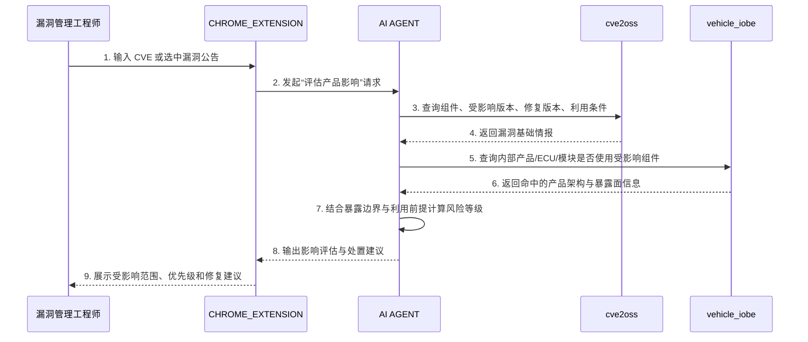

**核心价值**：在新漏洞公开后的第一时间，把“公开漏洞信息”快速映射到“我方产品受影响面”，将泛化的漏洞情报转化为可执行的排查、修复和风险沟通依据。

1. **触发**：漏洞管理工程师（`{4F4A31F1-2E7A-4F55-B8DB-7E7B9B22C001}`）在外部通报、CVE 公告或供应链安全播报中发现一个新披露漏洞，例如某个开源组件存在远程代码执行风险。

2. **漏洞解析**：

    - 工程师在 `CHROME_EXTENSION` 中输入 CVE 编号，或选中网页中的漏洞描述后发起“评估对我方产品影响”。

    - 后端 `AI AGENT` 首先调用 `cve2oss` 数据源，提取该漏洞对应的组件名称、受影响版本范围、修复版本、利用前提和 CVSS 等基础属性。

3. **资产与架构匹配**：

    - `AI AGENT` 根据漏洞命中的组件及版本条件，继续查询 `vehicle_iobe`，定位我方产品、ECU、软件模块或边界节点中是否存在该组件。

    - 若某个组件被多个产品线或多个 ECU 复用，Agent 会进一步归并出“受影响产品族”、“受影响系统模块”和“潜在暴露边界”。

4. **风险语境增强**：

    - 如果当前架构中还能查询到该组件所在节点的对外暴露面，例如蓝牙、Wi-Fi、蜂窝网络、USB、诊断接口等，Agent 会把“组件存在”与“可被远程利用的入口”结合起来重新判断风险等级。

    - 若漏洞需要本地权限、物理接触或特定配置才可利用，则 Agent 会在结论中明确降低紧急程度，避免仅凭 CVSS 做机械升级。

5. **输出评估结论**：`AI AGENT` 生成一份影响评估报告，指出：“漏洞 `CVE-2026-XXXX` 影响组件 `libabc` 的 `2.1.0 - 2.4.3` 版本。我方车型 A 的 T-Box 与车型 B 的 IVI 模块存在该版本组件，其中 T-Box 具备蜂窝外联能力，建议列为高优先级修复；IVI 模块默认未开放外部入口，建议列为中优先级并结合配置进一步确认。”

6. **行动闭环**：漏洞管理工程师根据报告，联动研发、测试和运维团队，形成补丁修复、临时缓解、版本排查和对外沟通清单，避免“知道有漏洞，但不知道是否影响自己产品”的处置空转。

**端到端业务过程（角色与系统交互）**：

## 该场景依赖的数据（基于当前对外 SCHEMA）

### 1. 数据源依赖

按 AI4X-Platform 当前公开的数据源注册表，这个场景直接相关的数据源是：

| source_id | 类型 | 用途 |
| --- | --- | --- |
| `cve2oss` | `proxy` | 提供以 `cve_id` + `sub_id` 为输入的漏洞查询代理能力，当前对外暴露的是接口契约和白名单返回字段。 |
| `vehicle_iobe` | `neo4j` | 提供 ECU、暴露面、外部对端、网络流量、消息及其关系，用于判断受影响对象是否具备可触达入口。 |
| `ecu_func` | `neo4j` | 提供 ECU 与相关功能列表，用于把命中的 ECU 进一步映射到功能域。 |
| `vehicle_func` | `neo4j` | 提供车辆功能与相关 ECU 列表，用于把影响从 ECU 层上卷到功能层。 |

如需补充“该漏洞是否已被威胁组织、恶意活动或在野利用关联”，可选接入：

| source_id | 类型 | 用途 |
| --- | --- | --- |
| `opencti` | `opencti` | 提供 STIX 2.1 漏洞、情报对象及关系，可用于风险语境增强，但不是当前最小闭环的必需项。 |

调用侧可通过以下接口发现并拉取 Schema：

1. `GET /api/v1/api-center/schema/catalog`
2. `GET /api/v1/api-center/schema/cve2oss`
3. `GET /api/v1/api-center/schema/vehicle_iobe`
4. `GET /api/v1/api-center/schema/ecu_func`
5. `GET /api/v1/api-center/schema/vehicle_func`

### 2. 当前 SCHEMA 下实际可用的对象与字段

这个场景最关键的一点是：**当前公开 SCHEMA 能直接支撑“CVE 命中哪些内部对象、这些对象是否有暴露面”，但还不能直接支撑完整的软件成分分析（SCA）式组件版本解析。**

#### `cve2oss`

`cve2oss` 当前不是 STIX 业务对象 Schema，而是一个 API 契约 Schema。当前直接可依赖的关键输入/输出字段是：

| 字段 | 位置 | 作用 |
| --- | --- | --- |
| `cve_id` | 请求字段 | 指定待评估的 CVE。 |
| `sub_id` | 请求字段 | 指定查询所需的业务标识。 |
| `CVEID` | 响应字段 | 返回命中的 CVE 编号。 |
| `PROD_CN_NAME` | 响应字段 | 返回产品中文名，可作为影响对象的业务线索。 |
| `EDITION_CODE` | 响应字段 | 返回版本/版本包标识。 |
| `LDY_NAME` | 响应字段 | 返回领域/版本归属信息。 |
| `HWPSIRTID` | 响应字段 | 返回内部漏洞跟踪标识。 |

需要特别说明：当前公开 `cve2oss` Schema **没有直接暴露** `cvss`、`attack_vector`、`attack_complexity`、`privileges_required`、`user_interaction`、`受影响组件名`、`受影响版本区间`、`修复版本` 这些字段。因此文档里如果把 `cve2oss` 描述为“直接返回完整漏洞技术属性”，会与当前公开 Schema 不一致。

#### `vehicle_iobe`

`vehicle_iobe` 当前公开支持的对象类型和关键字段如下：

| 对象类型 | 关键字段 | 在本场景中的作用 |
| --- | --- | --- |
| `x-vehicle-ecu` | `name`、`description`、`x_ecu_type`、`x_software_version`、`x_domain_tag` | 表示 ECU 本体，可用于定位受影响控制器，并提供 ECU 软件版本线索。 |
| `x-exposure-surface` | `name`、`description`、`x_domain_tag` | 表示蓝牙、Wi-Fi、USB、蜂窝、诊断口等暴露面。 |
| `x-external-peer` | `name`、`description`、`x_domain_tag` | 表示车云、手机、充电桩等外部交互对象。 |
| `network-traffic` | `name`、`protocols`、`src_ref`、`dst_ref`、`x_domain_tag` | 表示节点间通信路径，用于判断漏洞所在 ECU 是否经由外部链路可触达。 |
| `relationship` | `source_ref`、`target_ref`、`relationship_type`、`x_name`、`x_domain_tag` | 当前支持 `exposes`、`via_channel`、`transmitted_by`、`connects_to`、`communicates_with`、`related-to`，可用于串联 ECU 与暴露面。 |

#### `ecu_func`

| 对象类型 | 关键字段 | 在本场景中的作用 |
| --- | --- | --- |
| `x-ecu-controller` | `ecu_name`、`related_functions`、`x_domain_tag` | 用于把受影响 ECU 进一步映射到功能列表。 |

#### `vehicle_func`

| 对象类型 | 关键字段 | 在本场景中的作用 |
| --- | --- | --- |
| `x-vehicle-function` | `function_id`、`function_name`、`function_description`、`related_ecus`、`x_domain_tag` | 用于把影响从 ECU 层提升到车辆功能层。 |

### 3. 可选的威胁情报增强对象

如果需要把“新漏洞是否已被公开利用”纳入风险排序，可选使用 `opencti` 的 STIX 对象：

| STIX 对象 | 关键字段 | 在本场景中的作用 |
| --- | --- | --- |
| `vulnerability` | `id`、`name`、`description` | 表示漏洞对象本体。 |
| `relationship` | `relationship_type`、`source_ref`、`target_ref` | 用于把漏洞与攻击组织、恶意软件、活动等对象串联。 |

但需要注意：当前公开的 `vulnerability` 标准 Schema 也并不直接提供 `cvss`、`攻击向量` 等丰富技术字段，因此它更适合做“是否存在情报关联”的增强，而不是替代专门漏洞数据库。

### 4. 本场景当前可稳定完成的判断

依据当前公开数据源和 Schema，这个场景可以稳定支撑以下判断：

1. 输入一个 `cve_id` 后，能否通过 `cve2oss` 拿到与业务产品相关的基础命中结果。
2. 能否根据 `PROD_CN_NAME`、`EDITION_CODE`、`LDY_NAME`、`HWPSIRTID` 把漏洞命中结果映射到内部版本/产品线线索。
3. 能否在 `vehicle_iobe` 中定位相关 ECU、外部对端、暴露面和通信路径。
4. 能否结合 `vehicle_iobe` 的暴露面和 `ecu_func` / `vehicle_func` 的功能映射，给出“哪类 ECU 或功能域优先排查”的建议。

### 5. 当前 SCHEMA 暂不直接支撑的能力边界

基于当前公开 Schema，以下能力**不能被写成当前已直接具备**：

1. `cve2oss` 直接返回完整的组件名、供应商名、CPE、PURL、受影响版本区间、修复版本。
2. `vehicle_iobe` 直接提供 `product -> software component -> component version` 的软件 BOM 级关系。
3. 仅凭当前公开 Schema 就自动完成严格的“组件版本命中判断”。
4. 仅凭当前公开 Schema 就得出完整 CVSS 维度的技术打分。

因此，当前更准确的表述应是：该场景已具备“漏洞命中线索 + 内部暴露面映射 + 功能域上卷”的能力基础，但若要做到严格的软件成分影响评估，还需要补充更细的软件组件清单或版本依赖数据源。

### 6. 本场景最小数据闭环

按当前对外 Schema，这个场景可落地的最小闭环应描述为：

1. 通过 `cve2oss` 输入 `cve_id` 与 `sub_id`，获取 `CVEID`、`PROD_CN_NAME`、`EDITION_CODE`、`LDY_NAME`、`HWPSIRTID` 等命中线索。
2. 基于这些线索，在 `vehicle_iobe` 中定位相关 ECU、暴露面、外部连接对象及通信关系。
3. 通过 `ecu_func` 和 `vehicle_func` 把受影响对象从 ECU 层进一步映射到车辆功能层。
4. 如需情报增强，再通过 `opencti` 判断该漏洞是否已被关联到公开威胁活动或其他高风险上下文。
5. `AI AGENT` 输出“受影响产品/版本线索 + 受影响 ECU/功能域 + 暴露面 + 建议优先级 + 待人工确认项”。

### 7. 建议的场景结论表述

把当前场景与现有公开 Schema 对齐后，更准确的输出应该是：

1. 哪些产品线索或版本标识在 `cve2oss` 返回结果中命中了该 CVE。
2. 这些线索对应到哪些 ECU、哪些外部暴露面、哪些功能域。
3. 哪些对象具备蜂窝、Wi-Fi、蓝牙、USB、诊断口等外部入口，应优先排查。
4. 哪些判断是平台已根据现有 Schema 自动给出的，哪些仍需人工补充组件版本或配置事实。

### 8. 当前不构成本场景核心依赖的数据源

按当前公开 Schema，这个场景的最小前置条件并不是 `tara`、`ses`、`func_design_spec`。这些数据源更适合后续用于：

1. 把漏洞影响映射到威胁路径或风险分析结果。
2. 把漏洞影响映射到网络安全需求、设计规格或修复要求。
3. 形成更完整的整改计划与合规追踪。

在“新发现漏洞是否影响我方产品”的初步评估问题上，当前最小闭环应以 `cve2oss + vehicle_iobe + ecu_func + vehicle_func` 为主，`opencti` 为可选增强。