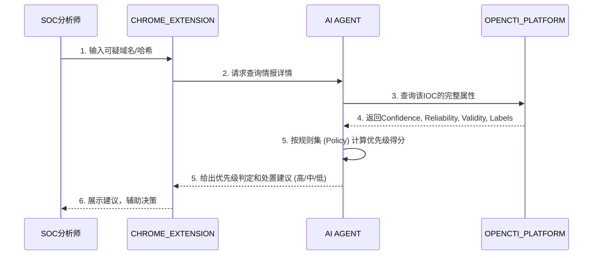

**核心价值**：解决安全运营中心告警疲劳问题，利用 OpenCTI 对每个 Indicator 的客观属性（置信度、有效期、可靠来源）进行智能排序。

1. **触发**：安全运营中心分析师（`{B3FBCCA5-C8B9-49ad-9283-BDF2A5C2AD86}`）收到一个外部系统（非本架构内）产生的告警，例如：`主机 10.2.3.4 解析了一个恶意域名 evil.com`。
    
2. **情报查询**：
    
    - 分析师在 `CHROME_EXTENSION` 中选中该域名，右键选择“查询 OpenCTI 情报”。
        
    - 后端 `AI AGENT` 向 `OPENCTI_PLATFORM` 发起针对 `evil.com` 的查询。
        
3. **获取多维属性**：OpenCTI 返回了该 Indicator 的详细情报：
    
    - **Confidence** (置信度): 85% (较高)
        
    - **Valid From / Until**: 有效期从 3 天前到 14 天后。
        
    - **Reliability** (来源可靠性): **Source A** (业内知名安全公司) vs **Source B** (未知匿名来源)。
        
    - **Threat Types**: Command & Control, Phishing.
        
    - **Labels**: `likely_false_positive` (被某来源标记为可疑但不确认)。
        
4. **AI 综合决策**：
    
    - `AI AGENT` 根据预设的规则集（Policy）进行打分：
        
        - 置信度 > 80% → +30分
            
        - 来源可靠性为“知名公司” → +20分
            
        - 有效期在3天内 → +10分
            
        - 存在 `likely_false_positive` 标签 → -50分
            
    - **最终评分：10分** -> **判定为低优先级**。
        
5. **行动建议与处置**：
    
    - Agent 返回建议：`告警为低优先级。虽然 evil.com 活跃且可信，但被多个来源标记为误报可能性高。建议维持监控，无需立即阻断。`
        
    - 分析师采纳建议，将告警标记为“跟踪观察”而非“应急响应”，大幅节省了研判时间。
        

**端到端业务过程**：

## 该场景依赖的数据（基于当前对外 SCHEMA）

### 1. 数据源依赖

该场景当前核心依赖的数据源是：

| source_id | 类型 | 用途 |
| --- | --- | --- |
| `opencti` | `opencti` | 提供 Indicator 及其置信度、有效期、标签、关联对象和来源引用，用于对外部告警做二次排序。 |

调用侧应优先通过以下接口发现并拉取 Schema：

1. `GET /api/v1/api-center/schema/catalog`
2. `GET /api/v1/api-center/schema/opencti`

### 2. 场景必需的对象类型

这个场景的最小可用数据闭环，核心是“外部告警中的 IOC -> OpenCTI 中的 Indicator -> Indicator 的置信度/有效期/标签 -> 处置建议”。因此至少需要以下对象：

| STIX 对象 | 关键字段 | 在本场景中的作用 |
| --- | --- | --- |
| `indicator` | `id`、`name`、`indicator_types`、`pattern`、`pattern_type`、`valid_from`、`valid_until` | 表示 IOC 的检测规则，是告警优先级排序的主对象。 |
| `relationship` | `id`、`relationship_type`、`source_ref`、`target_ref`、`start_time`、`stop_time` | 用于把 Indicator 与恶意软件、基础设施、攻击组织等上下文对象关联起来。 |

### 3. 场景必需的公共字段

当前公开 STIX Schema 中，这个场景最关键的排序依据并不都属于 `indicator` 私有字段，其中一部分来自 STIX 公共字段：

| 字段 | 所属层级 | 作用 |
| --- | --- | --- |
| `confidence` | `common/core` 公共字段 | 直接作为优先级打分输入，取值范围 0-100。 |
| `labels` | `common/core` 公共字段 | 用于表达 `likely_false_positive` 一类业务标签，适合做降权或例外处理。 |
| `external_references` | `common/core` 公共字段 | 用于保留来源引用、外部报告链接、来源编号等辅助证据。 |
| `created_by_ref` | `common/core` 公共字段 | 可用于标识是哪一个来源实体创建了该情报对象。 |

### 4. 与“有效期”和 IOC 落地直接相关的 observable 类型

由于外部告警通常落在域名、URL、IP、HASH 等 IOC 上，当前场景还依赖以下可观测对象或表达方式：

| Observable/表达方式 | 关键字段 | 在本场景中的作用 |
| --- | --- | --- |
| `domain-name` | `id`、`value`、`resolves_to_refs` | 适用于“主机解析恶意域名”类告警。 |
| `ipv4-addr` | `id`、`value`、`resolves_to_refs`、`belongs_to_refs` | 适用于恶意 IP、C2 IP、外联目的地址类告警。 |
| `url` | `id`、`value` | 适用于钓鱼链接、投递 URL、落地页类告警。 |
| `file` | `id`、`hashes`、`name` | 适用于文件 HASH 类告警。 |
| `indicator.pattern` | `pattern`、`pattern_type` | 用于把上述 observable 统一抽象为可匹配的检测规则。 |

### 5. 当前 SCHEMA 对“来源可靠性”的支持边界

文档中的 `Reliability` 很重要，但需要注意：

1. **当前公开的 STIX 2.1 Schema 中没有名为 `reliability` 的标准一级字段**。
2. 如果业务上需要“来源可靠性”，当前更稳妥的建模方式是组合使用：`created_by_ref`、`external_references`、`labels`，以及与来源实体相关的 `relationship`。
3. 也就是说，在当前对外 SCHEMA 下，它更适合被实现为**派生评分维度**，而不是依赖某个固定的原生字段。

### 6. 本场景最小数据闭环

按当前对外 Schema，这个场景至少需要具备以下数据链路：

1. 外部系统给出一个 IOC，例如域名、URL、IP 或文件 HASH。
2. OpenCTI 中存在一个能够命中该 IOC 的 `indicator`。
3. 该 `indicator` 至少具备 `confidence`、`valid_from`，最好还具备 `valid_until`、`labels`。
4. 如需提高解释性，可进一步通过 `relationship` 补齐该 Indicator 指向的 `malware`、`infrastructure`、`intrusion-set` 等上下文对象。
5. `AI AGENT` 基于 `confidence`、有效期窗口、标签和来源侧代理信息输出高/中/低优先级结论。

### 7. 对当前场景文案的落地修正

把当前文档中的业务描述映射到现有公开 SCHEMA 后，应理解为：

1. `Confidence`：有标准字段支撑，可直接使用。
2. `Valid From / Until`：有标准字段支撑，可直接使用。
3. `Labels`：有标准字段支撑，可直接使用。
4. `Threat Types`：更适合由 `indicator_types`，以及其关联的 `malware` / `infrastructure` / `attack-pattern` 共同表达。
5. `Reliability`：当前公开 SCHEMA 不存在同名标准字段，应作为派生属性实现，而不是假定为一级原生字段。

### 8. 当前不构成核心依赖的数据源

这个场景本质上是“外部告警 + OpenCTI 情报补强 + 策略打分”，因此 `tara`、`ses`、`vehicle_iobe`、`vehicle_func`、`ecu_func`、`func_design_spec`、`cve2oss` 并不是它成立的核心前置数据。