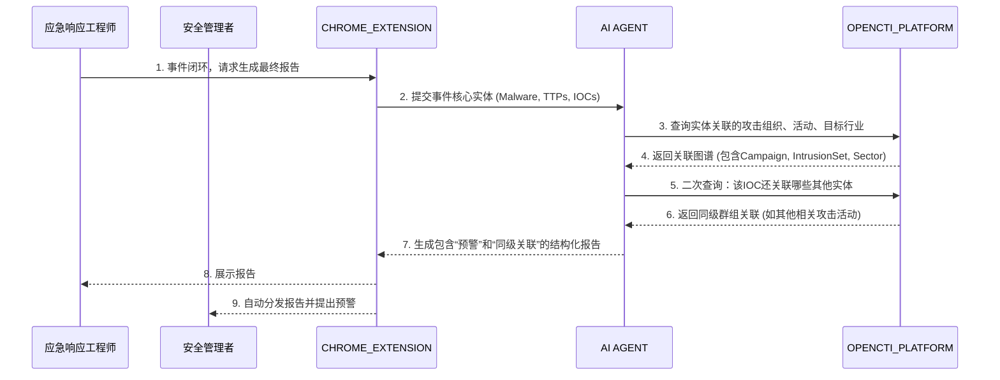

**核心价值**：当确认一个攻击事件后，自动生成完整的事件报告，并通过 OpenCTI 的“群组”关系发现同级或兄弟组织可能面临的相同风险。

1. **触发**：安全事件响应工程师（`{BA6B697E-683D-46e6-B7B7-36FACC367400}`）在处理完一起确认为“勒索软件 Ryuk 感染”的事件后，通过 `CHROME_EXTENSION` 请求生成最终调查报告。
    
2. **提取核心实体**：
    
    - `AI AGENT` 从事件响应记录中提取关键实体：`Malware = Ryuk`，以及捕获到的 `Indicator = 特定比特币地址`，`TTPs = T1486 (Impact/Data Encrypted for Impact)`。
        
3. **查询 OpenCTI 关联**：
    
    - Agent 向 `OPENCTI_PLATFORM` 查询：`与 Ryuk 相关的所有信息`。
        
    - OpenCTI 返回：Ryuk所属的`Intrusion Set` (如 Wizard Spider)，常用的`Attack Pattern` (T1486, T1496)，常见的`Targeted Sectors` (医疗、政府)，以及**关联的 Campaigns** (如 Operation Ghost)。
        
    - 同时，查询 `该比特币地址还关联到了哪些其他的 Intrusion Set 或 Campaign`。
        
4. **生成智能报告**：
    
    - 报告自动包含以下章节：
        
        - **事件概述**：Ryuk 勒索软件感染。
            
        - **威胁行为体**：Wizard Spider (UNC2547)。
            
        - **攻击动机与目标**：财务勒索，主要针对医疗行业。
            
        - **关联发现**：本次使用的比特币地址曾出现在另一起 `Operation Ghost` 攻击中。
            
        - **预测与预警**：**根据 OpenCTI 群组关系，贵单位所在行业的其他分支机构在未来一周内需高度警惕类似的钓鱼邮件。**
            
5. **分发与预警**：
    
    - 报告被自动发送给 `应急响应团队负责人` 和 `IT安全经理`。
        
    - 基于“群组关联”的预警，系统自动在 `安全态势感知` 面板上提升针对整个行业网段的监控级别。
        

**端到端业务过程**：

## 该场景依赖的数据（基于当前对外 SCHEMA）

### 1. 数据源依赖

该场景当前核心依赖的数据源是：

| source_id | 类型 | 用途 |
| --- | --- | --- |
| `opencti` | `opencti` | 提供 Malware、Intrusion Set、Campaign、Attack Pattern、Report、Grouping、Identity 及其关系，用于自动生成攻击事件报告和发现同级关联对象。 |

调用侧应优先通过以下接口获取 Schema：

1. `GET /api/v1/api-center/schema/catalog`
2. `GET /api/v1/api-center/schema/opencti`

### 2. 场景必需的实体对象

该场景的主线是“已确认事件 -> 提取恶意软件/IOC/TTP -> 查询其归属组织和关联活动 -> 生成报告 -> 找到同级群组或同业目标”。因此至少需要以下对象：

| STIX 对象 | 关键字段 | 在本场景中的作用 |
| --- | --- | --- |
| `malware` | `id`、`name`、`is_family`、`aliases`、`malware_types`、`capabilities`、`first_seen`、`last_seen` | 表示已确认攻击事件中的恶意软件主体，例如 `Ryuk`。 |
| `intrusion-set` | `id`、`name`、`aliases`、`description`、`first_seen`、`last_seen`、`goals` | 表示恶意软件所属的攻击组织/团伙，例如 `Wizard Spider`。 |
| `campaign` | `id`、`name`、`aliases`、`description`、`first_seen`、`last_seen`、`objective` | 表示同一攻击组织在一段时间内的具体活动，用于把单次事件扩展到已知行动。 |
| `attack-pattern` | `id`、`name`、`aliases`、`description`、`kill_chain_phases` | 表示 TTP，例如 `T1486`，用于支撑报告中的攻击技术章节。 |
| `indicator` | `id`、`name`、`pattern`、`pattern_type`、`valid_from`、`valid_until` | 表示事件中提取出的 IOC 检测规则。 |
| `relationship` | `id`、`relationship_type`、`source_ref`、`target_ref`、`start_time`、`stop_time` | 用于把 Malware、Campaign、Intrusion Set、Attack Pattern、Indicator 串联成事件图谱。 |

### 3. 支撑“自动化报告”的对象

如果要把查询结果沉淀为可复用、可分发的结构化报告，当前公开 SCHEMA 中直接相关的对象有：

| STIX 对象 | 关键字段 | 在本场景中的作用 |
| --- | --- | --- |
| `report` | `id`、`name`、`report_types`、`description`、`published`、`object_refs` | 适合表达最终生成的事件报告，以及报告里引用的关键对象集合。 |
| `grouping` | `id`、`name`、`description`、`context`、`object_refs` | 适合表达“同一事件上下文”“同一波次活动”“同一调查包”下的一组对象。 |

### 4. 支撑“同级群组关联”的对象

文档中的“同级或兄弟组织可能面临相同风险”，在当前公开 SCHEMA 下更适合通过以下两类对象来支撑：

| STIX 对象 | 关键字段 | 在本场景中的作用 |
| --- | --- | --- |
| `identity` | `id`、`name`、`identity_class`、`sectors`、`roles` | 用于表达受害组织、行业对象、分支机构或目标实体。`sectors` 可直接承载行业维度。 |
| `grouping` | `context`、`object_refs` | 用于把同一行业、同一调查上下文或同批风险对象组织在一起。 |

在当前 SCHEMA 下，“同级群组关联”不应只理解成组织架构上的群组字段，更适合理解为：

1. 通过 `relationship` 找到与本次事件共用 IOC、恶意软件或 Campaign 的其他对象。
2. 通过 `identity.sectors` 找到与当前受害单位处于同一行业的实体。
3. 通过 `grouping` / `report.object_refs` 把这些同类风险对象组织成一个可复用的情报包。

### 5. 场景中的 IOC 与观测数据

当前文档里举例的“特定比特币地址”需要单独说明：

1. 当前公开的 STIX 2.1 聚合 Schema 中**没有专门的比特币地址对象类型**。
2. 因此这类 IOC 在现有对外 SCHEMA 下，更适合通过 `indicator.pattern` 承载，或由 OpenCTI 自定义对象/扩展来补充。
3. 这意味着它可以继续作为业务场景里的 IOC 线索存在，但不应在文档中写成“当前公开 Schema 已有标准一级字段对象”。

对当前 SCHEMA 明确支持、并可直接作为 IOC 落地的对象包括：

| Observable 对象 | 关键字段 | 在本场景中的作用 |
| --- | --- | --- |
| `domain-name` | `id`、`value`、`resolves_to_refs` | 表示恶意域名、C2 域名。 |
| `ipv4-addr` | `id`、`value`、`resolves_to_refs`、`belongs_to_refs` | 表示恶意 IP、C2 IP、投递节点。 |
| `url` | `id`、`value` | 表示投递 URL、钓鱼 URL。 |
| `file` | `id`、`hashes`、`name` | 表示样本文件或 HASH。 |

### 6. 本场景最小数据闭环

按当前对外 Schema，这个场景至少要具备以下链路：

1. 事件中提取出 `malware`、`indicator`、`attack-pattern` 等核心实体。
2. 通过 `relationship` 将 `malware` 关联到 `intrusion-set` 和 `campaign`。
3. 通过 `relationship` 或 `report.object_refs` 把 `indicator`、`attack-pattern`、`campaign`、`intrusion-set` 聚合到同一事件知识包中。
4. 通过 `identity.sectors`、`grouping.object_refs` 或与其他实体共用的 `relationship`，识别同一行业、同类资产或同波次活动中的其他受影响对象。
5. 用 `report` 作为最终输出载体，自动生成结构化事件报告并支持分发。

### 7. 对当前场景文案的落地修正

把当前文档中的业务描述映射到现有公开 SCHEMA 后，应理解为：

1. `Ryuk`：由 `malware` 表达。
2. `Wizard Spider`：由 `intrusion-set` 或 `threat-actor` 体系表达，但本场景最稳定的“团伙级”对象是 `intrusion-set`。
3. `Operation Ghost`：由 `campaign` 表达。
4. `T1486`：由 `attack-pattern` 表达。
5. “最终调查报告”：由 `report` 表达最直接。
6. “同级群组/兄弟组织关联”：当前更适合通过 `identity`、`grouping`、`campaign` 和共享 `relationship` 组合实现。
7. “比特币地址 IOC”：当前公开 SCHEMA 不存在专门标准对象，应通过 `indicator.pattern` 或扩展对象间接表示。

### 8. 当前不构成核心依赖的数据源

该场景本质上是“事件复盘与情报关联扩展”，因此 `tara`、`ses`、`vehicle_iobe`、`vehicle_func`、`ecu_func`、`func_design_spec`、`cve2oss` 并不是它成立的核心前置数据。它们可在后续把事件映射到车辆资产、功能域或设计缺陷时再接入。